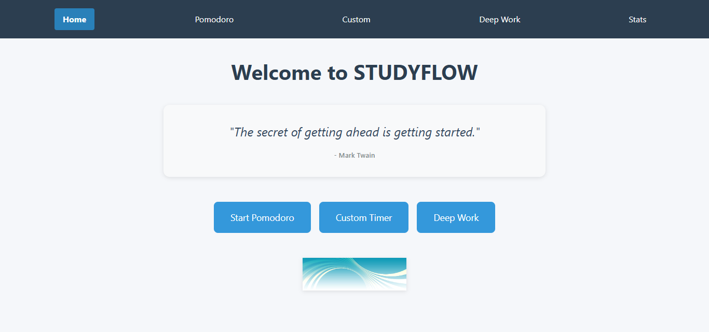

# STUDYFLOW – Smart Study Techniques, One Flow at a Time 🧠⏱️

 

## Table of Contents
- [Introduction](#introduction)
- [Features](#features)
- [Technologies Used](#technologies-used)
- [Installation](#installation)
- [Usage](#usage)
- [Project Structure](#project-structure)
- [API Endpoints](#api-endpoints)
- [Deployment](#deployment)
- [Contributing](#contributing)
- [License](#license)

## Introduction
STUDYFLOW is a digital study companion designed to help students:
- Improve time management and focus
- Discover effective study techniques
- Maintain motivation and consistency

The app implements science-backed methods like Pomodoro, Deep Work, and customizable study sessions with progress tracking and motivational support.

## Features
### Study Techniques
- 🍅 **Pomodoro Timer**: Classic 25/5 minute focus/break intervals
- ⚙️ **Custom Timer**: Set your own focus/break durations
- 🧠 **Deep Work Mode**: 90-minute focused sessions with long breaks

### Session Management
- ✍️ Session feedback logging (focus level, notes)
- 📊 Statistics dashboard with session history
- 🔄 CRUD operations on study sessions

### Additional Features
- 🎵 Background music player for focus
- 💬 Motivational quotes
- 📱 Responsive design for all devices

## Technologies Used
### Frontend
- React.js (Vite)
- React Router
- CSS/Tailwind (specify which you used)
- [Any other libraries you used]

### Backend
- json-server
- Deployed on Render.com

### Deployment
- Vercel (frontend)
- Render (backend)

## Installation
To run STUDYFLOW locally:

1. Clone the repository:
```bash
git clone https://github.com/yourusername/studyflow.git

Install dependencies:

bash
cd studyflow
npm install
Start the development server:

bash
npm run dev
(Optional) Run the JSON server:

bash
npm run server
The app should now be running on http://localhost:5173 (or your configured port).

Usage
Choose a study technique from the homepage

Start your timer and focus!

After each session, log your feedback

Track your progress in the Stats section

Use the music player to enhance focus

Project Structure
text
studyflow/
├── public/
│   └── index.html
├── src/
│   ├── assets/
│   │   ├── images/      # All project images
│   │   └── music/       # Background music files
│   ├── components/
│   │   ├── NavBar.jsx
│   │   ├── PomodoroTimer.jsx
│   │   ├── CustomTimer.jsx
│   │   ├── DeepWorkTimer.jsx
│   │   ├── SessionForm.jsx
│   │   ├── SessionCard.jsx
│   │   ├── StatsPanel.jsx
│   │   └── MusicPlayer.jsx
│   ├── pages/
│   │   ├── Home.jsx
│   │   ├── Pomodoro.jsx
│   │   ├── Custom.jsx
│   │   ├── DeepWork.jsx
│   │   └── Stats.jsx
│   ├── App.jsx
│   ├── main.jsx
│   ├── utils/
│   │   └── useTimer.js
│   └── styles/
│       └── App.css
├── db.json
├── package.json
└── README.md
API Endpoints
The backend provides these endpoints:

GET /sessions - Fetch all study sessions

POST /sessions - Create a new session

PATCH /sessions/:id - Update a session

DELETE /sessions/:id - Remove a session

Base URL: https://studyflow-0rqf.onrender.com

Deployment
The project is deployed on:

Frontend: https://studyflow-xi.vercel.app

Backend: https://studyflow-0rqf.onrender.com

Contributing
Contributions are welcome! Please follow these steps:

Fork the repository

## Project Structure
studyflow/
├── public/
├── src/
│ ├── assets/ # Images & music
│ ├── components/ # Reusable components
│ ├── pages/ # Route components
│ ├── utils/ # Custom hooks
│ └── styles/ # Global styles
├── db.json # Mock database
└── package.json

## Contributing
Contributions are welcome! Please follow these steps:
1. Fork the repository
2. Create a new branch (`git checkout -b feature/your-feature`)
3. Commit your changes (`git commit -m 'Add some feature'`)
4. Push to the branch (`git push origin feature/your-feature`)
5. Open a Pull Request

🙏 Credits
Timer logic inspired by Cal Newport's Deep Work
text
Push to the branch (git push origin feature/your-feature)

Open a Pull Request

## Credits & Acknowledgements
- Timer logic inspired by Cal Newport's Deep Work methodology
- Developed with ❤️ by Group 6:
  - Ann Ngatia
  - Mohamed Ahmed
  - James Patrick
